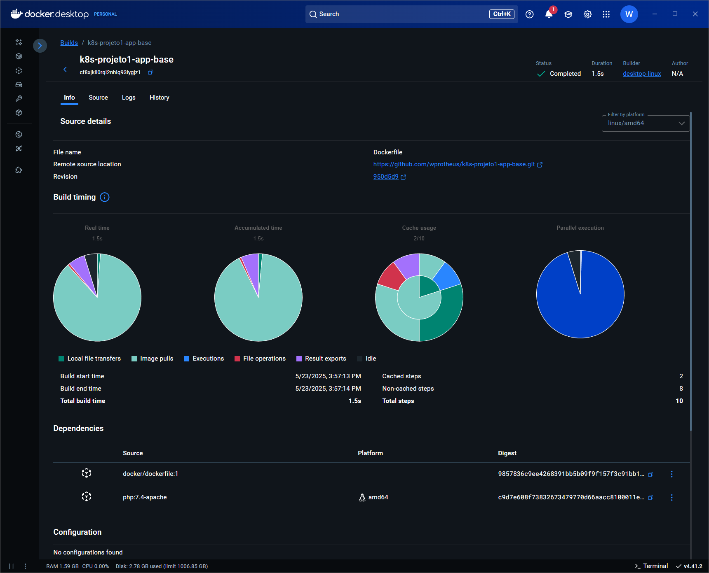

# DIO - Java and AI in Europe

## Autor
🔸[wprotheus](https://github.com/wprotheus)

---

### Abstraindo um Bootcamp Usando Orientação a Objetos em Java

Atividade executada, replicando os passos/codificação contidos nos vídeos, sendo assim uma quase cópia da solução apresentada, e conforme orientações abaixo, retiradas da [Descrição do Desafio](https://web.dio.me/lab/criando-um-deploy-de-uma-aplicacao/learning/c3f8fdf5-8cae-451f-b488-1f3428c26086)  
<small>Obs.: O link acima somente é acessado através de uma conta na plataforma DIO.</small>

### Entendendo o Desafio

> Agora é a sua hora de brilhar e construir um perfil de destaque na DIO! Explore todos os conceitos explorados até aqui e replique (ou melhore, porque não?) este projeto prático. Para isso, crie seu próprio repositório e aumente ainda mais seu portfólio de projetos no GitHub, o qual pode fazer toda diferença em suas entrevistas técnicas 😎

### Descrição em Informações

> Neste projeto será realizado um deploy de uma aplicação completa com frontend, backend e database mysql. No desenvolvimento do projeto serão criadas as imagens dos containeres e serviços necessários no kubernetes para que a aplicação esteja pronta para produção.

---

## 📷 Captura de tela

### Tela #1:
  